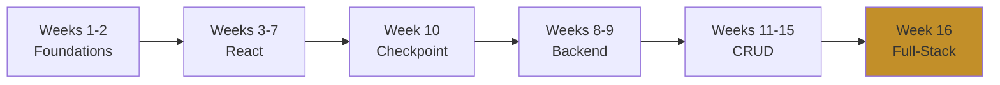

<style src="./style.css"></style>

# Movie Buzz MERN Stack

## 16-Week Progressive Curriculum

<div class="pt-12">
  <span class="text-6xl">🎬</span>
</div>

From Zero to Full-Stack Developer

<div class="abs-br m-6 flex gap-2">
  <span class="text-sm opacity-50">MERN: MongoDB, Express, React, Node.js</span>
</div>

---

layout: two-cols
---

# Week 1

## Bash & Git Foundations

### What Students Learn

- Terminal navigation
- Git version control
- Command line basics

### Movie Buzz Progress

- 📁 Basic HTML/CSS setup
- 🔄 Git repository init
- 🛠️ Development workflow

::right::

<div class="mt-20">

### Key Outcome

<div class="text-lg mt-4 p-4 bg-gray-800 rounded">
Master terminal and version control fundamentals
</div>

</div>

---

layout: two-cols
---

# Week 2

## Development Environment

### What Students Learn

- Node.js & npm setup
- Create React App
- VS Code configuration

### Movie Buzz Progress

- ⚛️ React app initialization
- 📂 Project structure
- 🚀 Dev server running

::right::

<div class="mt-20">

### Key Outcome

<div class="text-lg mt-4 p-4 bg-gray-800 rounded">
Professional React development environment ready
</div>

</div>

---

# Week 3: Intro to React

<div class="grid grid-cols-2 gap-8">

<div>

### What Students Learn

- Functional components
- JSX syntax
- Props
- Component composition

### Components Built

- `MoviesList`
- `MovieBlock`
- `TrendingNow`

</div>

<div>

### Visual Progress

<div class="bg-gray-900 p-4 rounded text-sm">

Static movie cards with:

- Movie posters
- Title, director, stars
- Netflix dark theme
- Horizontal layout

</div>

<div class="mt-6 p-3 bg-yellow-900/30 rounded border border-yellow-600/50">
<strong>Outcome:</strong> Component architecture mastery
</div>

</div>

</div>

---

# Week 4: React State & Hooks

<div class="grid grid-cols-2 gap-8">

<div>

### What Students Learn

- `useState` hook
- `useEffect` hook
- Event handlers
- State management basics

### Features Added

- ⭐ Favorites toggle
- 📖 Expand/collapse details
- 🎯 Interactive buttons
- 💾 State persistence

</div>

<div>

### Visual Progress

<div class="bg-gray-900 p-4 rounded text-sm">

```jsx
const [favorites, setFavorites] = useState([]);
const [expanded, setExpanded] = useState(false);

// Toggle favorite
const toggleFavorite = (id) => {
  // Update state
};
```

</div>

<div class="mt-6 p-3 bg-yellow-900/30 rounded border border-yellow-600/50">
<strong>Outcome:</strong> State management fundamentals
</div>

</div>

</div>

---

# Week 5: React Events & Forms

<div class="grid grid-cols-2 gap-8">

<div>

### What Students Learn

- Form handling
- React Router
- Controlled components
- Navigation

### Components Added

- `Header` navigation
- `Footer` site-wide
- `MovieForm` add/edit
- Route configuration

</div>

<div>

### Routes Added

<div class="bg-gray-900 p-4 rounded text-sm">

```
/ → Home page
/new → Add movie
/edit/:id → Edit movie
```

</div>

<div class="mt-6 p-3 bg-yellow-900/30 rounded border border-yellow-600/50">
<strong>Outcome:</strong> Multi-page React applications
</div>

</div>

</div>

---

# Week 6: Component Patterns

<div class="grid grid-cols-2 gap-8">

<div>

### What Students Learn

- Component composition
- Children props
- Error boundaries
- Loading states

### Features Added

- Modal components
- Skeleton screens
- Error handling
- Reusable patterns

</div>

<div>

### Pattern Examples

<div class="bg-gray-900 p-4 rounded text-sm">

```jsx
<Modal>
  <ConfirmDelete />
</Modal>

<ErrorBoundary>
  <MoviesList />
</ErrorBoundary>
```

</div>

<div class="mt-6 p-3 bg-yellow-900/30 rounded border border-yellow-600/50">
<strong>Outcome:</strong> Production-quality components
</div>

</div>

</div>

---

# Week 7: Advanced Hooks & Context

<div class="grid grid-cols-2 gap-8">

<div>

### What Students Learn

- Custom hooks
- Context API
- `useReducer`
- Performance optimization

### Features Added

- Theme context
- Favorites context
- `useMovies()` hook
- `useLocalStorage()` hook

</div>

<div>

### Context Pattern

<div class="bg-gray-900 p-4 rounded text-sm">

```jsx
const ThemeContext = createContext();

function App() {
  const [theme, setTheme] = useState('dark');

  return (
    <ThemeContext.Provider value={{theme}}>
      {children}
    </ThemeContext.Provider>
  );
}
```

</div>

<div class="mt-6 p-3 bg-yellow-900/30 rounded border border-yellow-600/50">
<strong>Outcome:</strong> Advanced React patterns
</div>

</div>

</div>

---

# Week 8: Node.js & HTTP

<div class="grid grid-cols-2 gap-8">

<div>

### What Students Learn

- Server-side JavaScript
- File system operations
- HTTP protocol
- Creating servers

### Backend Begins 🟢

- Basic HTTP server
- JSON data handling
- GET endpoints
- File operations

</div>

<div>

### Server Setup

<div class="bg-gray-900 p-4 rounded text-sm">

```
server/
├── server.js
├── data/
│   └── movies.json
└── package.json
```

```bash
Server: localhost:4000
GET /movies → JSON
```

</div>

<div class="mt-6 p-3 bg-yellow-900/30 rounded border border-yellow-600/50">
<strong>Outcome:</strong> Backend fundamentals
</div>

</div>

</div>

---

# Week 9: Express & RESTful APIs

<div class="grid grid-cols-2 gap-8">

<div>

### What Students Learn

- Express framework
- RESTful API design
- CORS setup
- Route organization

### API Endpoints

- `GET /api/movies`
- `POST /api/movie/new`
- `GET /api/movie/:id`
- `PUT /api/movie/:id`
- `DELETE /api/movie/:id`

</div>

<div>

### Project Structure

<div class="bg-gray-900 p-4 rounded text-sm">

```
server/
├── server.js
├── routes/
│   └── movieRoutes.js
├── controllers/
│   └── movieController.js
└── data/
```

</div>

<div class="mt-6 p-3 bg-yellow-900/30 rounded border border-yellow-600/50">
<strong>Outcome:</strong> Professional REST API
</div>

</div>

</div>

---

# Week 10: Tic-Tac-Toe Checkpoint 🎮

<div class="grid grid-cols-2 gap-8">

<div>

### Why This Checkpoint?

- 🔄 Reinforce React skills
- 🎯 Different context
- 💪 Build confidence
- 📚 Prep for backend

### Game Features

- Two-player mode
- Win detection
- State management
- Reset functionality

</div>

<div>

### Strategic Break

<div class="bg-gray-900 p-4 rounded text-sm">

Complete interactive game:

- 3x3 game board
- X vs O gameplay
- Winner detection
- Score tracking

</div>

<div class="mt-6 p-3 bg-yellow-900/30 rounded border border-yellow-600/50">
<strong>Outcome:</strong> React mastery via game dev
</div>

</div>

</div>

---

# Week 11: Introduction to MongoDB

<div class="grid grid-cols-2 gap-8">

<div>

### What Students Learn

- NoSQL databases
- Document modeling
- MongoDB setup
- Shell commands

### Database Begins 🍃

- Local installation
- Database design
- Schema planning
- Basic operations

</div>

<div>

### Movie Schema

<div class="bg-gray-900 p-4 rounded text-sm">

```javascript
{
  name: String,
  description: String,
  rating: String,
  year: Number,
  genre: [String],
  director: String,
  stars: [String]
}
```

</div>

<div class="mt-6 p-3 bg-yellow-900/30 rounded border border-yellow-600/50">
<strong>Outcome:</strong> NoSQL fundamentals
</div>

</div>

</div>

---

# Week 12: Mongoose & READ

<div class="grid grid-cols-2 gap-8">

<div>

### What Students Learn

- Mongoose ODM
- Schema validation
- Query methods
- Async/await patterns

### READ Operations

- `Movie.find()` - All
- `Movie.findById()` - One
- Database seeding
- Connection setup

</div>

<div>

### Implementation

<div class="bg-gray-900 p-4 rounded text-sm">

```javascript
const movieSchema = new Schema({
  name: {
    type: String,
    required: true
  },
  genre: [String],
  year: Number
});

const Movie = model('Movie', movieSchema);
```

</div>

<div class="mt-6 p-3 bg-yellow-900/30 rounded border border-yellow-600/50">
<strong>Outcome:</strong> Database READ ops
</div>

</div>

</div>

---

# Week 13: CREATE Functionality ⭐

<div class="grid grid-cols-2 gap-8">

<div>

### What Students Learn

- POST endpoints
- Data validation
- Request body parsing
- Status codes

### User Flow

1. Fill out form
2. Submit button
3. POST request
4. Validate data
5. Save to MongoDB
6. Show new movie

</div>

<div>

### Implementation

<div class="bg-gray-900 p-4 rounded text-sm">

```javascript
POST /api/movie/new

const newMovie = new Movie(req.body);
await newMovie.save();

res.status(201).json(newMovie);
```

</div>

<div class="mt-6 p-3 bg-green-900/30 rounded border border-green-600/50">
<strong>✅ CREATE Complete</strong>
</div>

</div>

</div>

---

# Week 14: UPDATE Functionality ⭐

<div class="grid grid-cols-2 gap-8">

<div>

### What Students Learn

- PUT endpoints
- Document updates
- ObjectId validation
- Partial updates

### Edit Flow

1. Click "Edit"
2. Pre-filled form
3. Modify fields
4. Submit
5. Update MongoDB
6. Show changes

</div>

<div>

### Implementation

<div class="bg-gray-900 p-4 rounded text-sm">

```javascript
PUT /api/movie/:id

const updated = await Movie
  .findByIdAndUpdate(
    req.params.id,
    req.body,
    { new: true }
  );
```

</div>

<div class="mt-6 p-3 bg-green-900/30 rounded border border-green-600/50">
<strong>✅ UPDATE Complete</strong>
</div>

</div>

</div>

---

# Week 15: DELETE Functionality ⭐

<div class="grid grid-cols-2 gap-8">

<div>

### What Students Learn

- DELETE endpoints
- Safe deletion
- Confirmation patterns
- 404 handling

### Delete Flow

1. Click "Delete"
2. Confirm modal
3. DELETE request
4. Remove from DB
5. Update UI

</div>

<div>

### Implementation

<div class="bg-gray-900 p-4 rounded text-sm">

```javascript
DELETE /api/movie/:id

const deleted = await Movie
  .findByIdAndDelete(req.params.id);

if (!deleted) {
  return res.status(404).json({
    error: 'Not found'
  });
}
```

</div>

<div class="mt-6 p-3 bg-green-900/30 rounded border border-green-600/50 text-lg">
<strong>✅ CRUD COMPLETE!</strong>
</div>

</div>

</div>

---

# Week 16: Full-Stack Integration 🚀

<div class="grid grid-cols-2 gap-6">

<div>

### Complete Integration

- Frontend ↔ Backend
- API state management
- Loading states
- Error handling
- All CRUD via API

### CRUD Operations Live

- ✅ CREATE via API
- ✅ READ from MongoDB
- ✅ UPDATE documents
- ✅ DELETE with confirm

</div>

<div>

### Optional Features ⭐

*For students with extra time*

<div class="bg-gray-900 p-3 rounded text-sm">

**Advanced Search/Filter/Sort:**

- 🔍 Search (name, director, stars)
- 🎭 Filter by genre
- ⭐ Filter by rating
- 📊 Sort options
- 📈 Results counter

</div>

<div class="mt-4 p-3 bg-gradient-to-r from-yellow-900/30 to-green-900/30 rounded border-2 border-yellow-600/50">
<strong>🎓 Full-Stack Developer!</strong>
</div>

</div>

</div>

---

layout: center
class: text-center
---

# Final Application

<div class="grid grid-cols-2 gap-8 mt-8 text-left">

<div>

### Frontend Skills

- ⚛️ React components & hooks
- 🎨 Netflix-style UI
- 📱 Responsive design
- 🎯 React Router
- 💾 State management
- ⚡ Loading & errors

</div>

<div>

### Backend Skills

- 🟢 Node.js & Express
- 🍃 MongoDB & Mongoose
- 🔄 Complete REST API
- ✅ Full CRUD
- 🛡️ Validation
- 📊 Array handling

</div>

</div>

---

layout: center
class: text-center
---

# 16-Week Journey

<div class="mt-8">



</div>

<div class="mt-12 text-3xl font-bold bg-gradient-to-r from-yellow-600 to-yellow-400 bg-clip-text text-transparent">
Zero to Full-Stack in 16 Weeks! 🎬
</div>

---

layout: end
class: text-center
---

# Thank You

<div class="mt-8">
  <span class="text-8xl">🎬</span>
</div>

<div class="mt-8 text-xl">
Movie Buzz - Complete MERN Stack Journey
</div>

<div class="mt-4 opacity-70">
MongoDB • Express • React • Node.js
</div>
